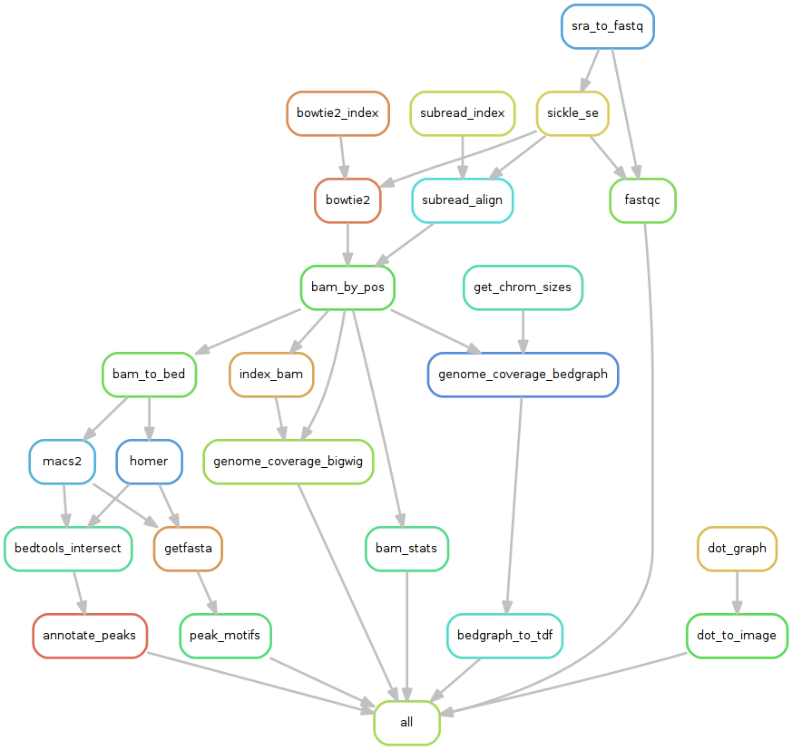
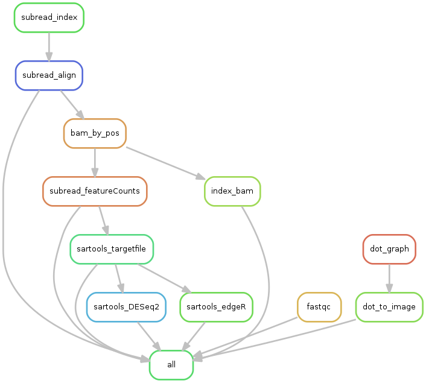

# Gene Regulation @ Calanques BCF  
*Authors : Edlira Nano, Claire Rioualen*

This program holds shared code to produce workflows for the analysis of Next
Generation Sequencing data related to gene regulation: ChIP-seq,
RNA-seq, and related technologies, as used at the Calanques BCF (Bioinformatics Core Facility, TAGC & IBDM labs). 

This program is a fork of the original France Genomique Workpackage 2.6 - Gene Regulation : https://github.com/rioualen/gene-regulation.

This version of the gene-regulation package follows the guidelines of: 
1) [report of the RNA-seq meeting @ TAGC](https://github.com/TAGC-bioinformatics/RNAseqmake/blob/master/doc/preliminaries/report-RNA-seq-pipeline.md) 

# Installation

This program is written in the [Snakemake workflow management system](https://bitbucket.org/snakemake/snakemake/wiki/Home)[1]. Python, shell and R scripts are called from the snakemake workflows. In addition, several well-known NGS analysis tools are called from the snakemake workflows. 

Most of these softwares are packaged for [debian-based systems](https://www.debian.org/misc/children-distros). If not, 
we refer to the [install.md instructions file](https://github.com/TAGC-bioinformatics/gene-regulation/blob/master/install.md). 

## Prerequisites
For this program to run you will need to install the following software :

* R 3+ (debian packaged)
* Python 2.7/3.4 (debian packaged)
* Snakemake 3.4+ (debian packaged)

Depending on the rules and workflow you will use on your analysis, you may also need to install the following :

* [SRA Toolkit](http://www.ncbi.nlm.nih.gov/Traces/sra/sra.cgi?view=software) (debian packaged)
* [Sickle](https://github.com/najoshi/sickle) (debian packaged)
* BWA (debian packaged)
* Bowtie (debian packaged)
* [Bowtie 2](http://bowtie-bio.sourceforge.net/) (debian packaged)
* [SAMtools 1.3+](http://samtools.sourceforge.net/) (debian packaged)
* [FastQC](http://www.bioinformatics.babraham.ac.uk/projects/fastqc/) (0.11.2+) (debian packaged)
* [bedtools](http://bedtools.readthedocs.org/) (debian packaged)
* [HOMER](http://homer.salk.edu/homer/index.html), blast, weblogo/seqlogo (see [install.md file](https://github.com/TAGC-bioinformatics/gene-regulation/blob/master/install.md)
* [SARtools](https://github.com/PF2-pasteur-fr/SARTools) (packaged for R or bioconda, see [install.md file](https://github.com/TAGC-bioinformatics/gene-regulation/blob/master/install.md)
* MACS 14 (1.4.3)
* [MACS2](https://github.com/taoliu/MACS/)
* [SWEMBL](http://www.ebi.ac.uk/~swilder/SWEMBL/)
* ...

### Installing of non debian-packaged software

#### [Homer install](http://homer.salk.edu/homer/introduction/install.html)

Homer needs `seqlogo` and `blat` programs to run, both not packaged:

#### To install `blat` on Linux:   
1 take the latest blatSrcXX.zip archive from https://users.soe.ucsc.edu/~kent/src/  
2 install it on /usr/local following instruction from 
http://nix-bio.blogspot.fr/2013/10/installing-blat-and-blast.html  
3 to avoid the "jkweb.a no rule" problem compile it with make MACHTYPE=$MACHTYPE  

#### To install `seqlogo`:
You have to install the `weblogo` archive  from http://weblogo.berkeley.edu/
The archive already contains the seqlogo binary file ready for use.  

#### [SARtools install](https://github.com/PF2-pasteur-fr/SARTools)
On the [SARtools GitHub page](https://github.com/PF2-pasteur-fr/SARTools) follow the install instructions on the README file, to install it either within `R`, or using `bioconda`.

## Alternative installation options

The original project also contains a makefile that installs all the tools and dependencies used by gene-regulation. 
*[NB currently only ChIP-seq dependencies are included, RNA-seq specific tools are to be included soon.]*

```
make -f gene-regulation/scripts/makefiles/install_tools_and_libs.mk all
source ~/.bashrc
```
### Virtualization

The original poject recommends using one of the  [tutorials on virtualization](doc/gene-regulation_tutorials), in order to run the workflows under a unix system without damaging your installation. 
**Full tutorials** can be found in the `doc` section, including the creation of a virtual machine/docker container, the installation of all the tools and dependencies and the execution of the workflows: [`doc/gene-regulation_tutorials`](doc/gene-regulation_tutorials).
These tutorials have been developed for ChIP-seq studies; however RNA-seq pipelines are soon to be included. 

# The workflows

The workflows and the individual rules that form them are written in Snakemake. 
Snakemake is a programmimg tool that enables the creation of analysis pipelines, based on the python language and the make concepts of rules and targets. 

A rule contains the commands to generate a given target. 
A workflow can be defined as a series of files generated by successive rules. 

This program contains several reusable NGS-specific rules, as well as a few workflow examples for standard ChIP-seq and RNA-seq analyses. 

**A tutorial on Snakemake** basic usage is available in the doc section: [`doc/snakemake_tutorial`](doc/snakemake_tutorial).

## Example study cases (data and workflow)

In the [example directory](https://github.com/TAGC-bioinformatics/gene-regulation/tree/master/examples) you will find several case studies ready to be tested. Each study includes the following files:

  * `config.yml`, a configuration file that contains the necessary paths and parameters
  * `samples.tab` contains a list of sample IDs, and possibly any additional info on samples
  * `design.tab` contains the samples to be compared (typically, pairs of ChIP/input in a ChIP-seq study)
  * `README.md`, a file describing how to execute the corresponding workflow

Follow the instructions in the `README.md` file in order to execute the whole workflow, using one of the ready-to-use [workflows](https://github.com/TAGC-bioinformatics/gene-regulation/tree/master/scripts/snakefiles/workflows).

These workflows generate a flowchart of the analysis, fo example here is the chart for ChIP-seq_SE_GSE20870 study case:


# An RNA-seq workflow example (workflow and results)

The Flavio analyses is a tumor versus control case study of mouse RNA-seq paired-ended fastq files. The [Flavio workflow](https://github.com/TAGC-bioinformatics/gene-regulation/blob/master/scripts/snakefiles/workflows/RNA-seq_workflow_PE_Flavio.wf) we designed performed:  
1. quality control with fastqc
2. mapping with subread-align
3. indexing with subread-index
4. feature count with subread
5. differential expression in R with SARtools (edgeR and DESeq2)

Here is the chart for this workflow  :


The differential expression performed via SARtools in the workflow, produces the following reports :
- [the edgeR results report](https://github.com/TAGC-bioinformatics/gene-regulation/blob/master/examples/reports/Flavio_Tumor_vs_Control_subread-align_edgeR_report.html)
- [the DESeq2 results report](https://github.com/TAGC-bioinformatics/gene-regulation/blob/master/examples/reports/Flavio_Tumor_vs_Control_subread-align_DESeq2_report.html)

# Documentation

More documentation can be found in the `doc` directory.

It includes: 

* A Snakemake tutorial section (`snakemake_tutorial`)
* General tutorials on NGS tools installation, RSAT installation... (`install_protocols`)
* Instructions for building a virtual machine on the IFB cloud / under VirtualBox / using a Docker image in order to run a snakemake workflow (`gene-regulation_tutorials`)


Some general information about NGS can be found in the **Wiki** section. 

# Contact

At the BCF:   
- Bianca Habermann <bianca.habermann@univ-amu.fr>
- Edlira Nano <edlira.nano@inserm.fr>

At the TAGC: (original gene-regulation package)  
- Claire Rioualen <claire.rioualen@inserm.fr>
- Jacques van Helden <Jacques.van-helden@univ-amu.fr>

# References 

1. Köster, Johannes and Rahmann, Sven. "Snakemake - A scalable bioinformatics workflow engine". Bioinformatics 2012.

